# 🏗️ Architecture & Design

This document explains the technical design of the Lqitha project, focusing on the separation of concerns, data abstraction, and the backend/frontend integration patterns.

---

## 1. High-Level Overview

Lqitha follows a **Client-Server Architecture** but retains the ability to run in a standalone **Local Mode**.

```mermaid
graph TD
    User[📱 User App] <-->|Cubit| BL[Business Logic Layer]
    BL <-->|Repository Interface| Repo[Repository Layer]
    
    subgraph Data Layer
        Repo -->|Switch| Remote[☁️ API Data Source]
        Repo -->|Switch| Local[💾 Local SQLite Source]
    end
    
    Remote <-->|HTTP/REST| Flask[🐍 Flask Backend]
    Flask <-->|SQL| Supabase[(🗄️ PostgreSQL)]
    Local <-->|SQL| SQLite[(📂 SQLite)]
```



---

## 2. Frontend Architecture (Flutter)

The app uses **Clean Architecture** principles with **Cubit** for state management.

### **Directory Structure**
```
lib/
├── config/          # API Config & Feature Flags
├── cubits/          # State Management (Business Logic)
├── data/            # Data Layer
│   ├── models/      # Data Models (User, Post)
│   ├── repositories/# Repository Implementations
│   └── services/    # External Services (API Client, DB)
├── screens/         # UI Pages
└── widgets/         # Reusable UI Components
```

### **The Repository Pattern**
This is the core architectural strength. The UI never talks to the API or Database directly. It talks to an **abstract repository**.

**Why?**
This allows us to switch between the Local SQLite database and the Remote API by changing a single boolean flag in `lib/config/api_config.dart`.

*   `FoundRepository` (Base Class)
    *   `LocalFoundRepository` (Implementation: Uses `sqflite`)
    *   `ApiFoundRepository` (Implementation: Uses `http` to call Flask)

**Dependency Injection:**
We use `GetIt` (`service_locator.dart`) to bind the correct implementation at startup based on `ApiConfig.USE_API`.

---

## 3. Backend Architecture (Flask)

The backend is built with **Flask** using the **Blueprint** pattern for modularity.

### **Structure**
```
flask_backend/
├── app/
│   ├── routes/        # API Endpoints (Auth, Posts, Admin)
│   ├── services/      # Business Logic
│   ├── utils/         # Helpers (Security, Validators)
│   └── __init__.py    # App Factory
├── run.py             # Entry Point
└── tests/             # Pytest Suite
```

### **Security Layer**
1.  **JWT (JSON Web Tokens)**: Used for stateless authentication. Every request to a protected route must include a valid Bearer token.
2.  **Bcrypt**: Passwords are hashed with unique salts before storage.
3.  **Input Validation**: All incoming data is rigorously validated (regex for emails, length checks) before touching the database.

---

## 4. The "LQITOU" Flow (Claiming Logic)

The "Claim" feature is a complex interaction:

1.  **User A** posts a "Found Item".
2.  **User B** sees the item and recognizes it.
3.  **User B** clicks "It's Mine!" (LQITOU).
4.  **System Action**:
    *   Sends a `POST /claim` request.
    *   Backend verifies user identity.
    *   Backend triggers a **Notification** to User A ("Someone claimed your item!").
5.  **User A** receives the alert and can view User B's contact details to arrange a meetup.

---

## 5. Database Schema (Supabase/PostgreSQL)

The database is normalized into 4 main tables:

*   **Users**: Stores credentials and profiles.
*   **FoundPosts**: Items found by users.
*   **LostPosts**: Items lost by users.
*   **Notifications**: Alert system linking users and posts.

*See [API_REFERENCE.md](API_REFERENCE.md) for the full schema definition.*
