# 🏗️ Lqitha Architecture & Technical Design

This document provides a deep dive into the technical architecture of the Lqitha platform, including the data layer, backend integration, and the "LQITOU" verification flow.

---

## 1. System Overview

Lqitha operates on a **Client-Server Architecture** with a unique **Dual-Database Adapter**. This allows developers to work offline using SQLite or connect to the production environment (Flask + Supabase) by flipping a single switch.

```mermaid
graph TD
    User[📱 Flutter App] <-->|Cubit| BL[Business Logic Layer]
    BL <-->|Repository Interface| Repo[Repository Layer]
    
    subgraph Data Layer
        Repo -->|Switch| API[☁️ API Data Source]
        Repo -->|Switch| Local[💾 Local SQLite Source]
    end
    
    API <-->|REST/JWT| Flask[🐍 Flask Backend]
    Flask <-->|PostgreSQL| Supabase[(🗄️ Supabase)]
    Local <-->|SQL| SQLite[(📂 SQLite File)]
```

> [!NOTE]
> The switching logic is controlled by `USE_API` in `lib/config/api_config.dart`.

---

## 2. Frontend Architecture (Flutter)

The mobile app follows **Clean Architecture** principles, ensuring that UI components are decoupled from data sources.

### **State Management: BLoC/Cubit**
We use `flutter_bloc` for its predictability and testability. Each feature (Auth, Founds, Losts, Notifications) has its own Cubit.

- **Initial State**: Loading or placeholder data.
- **Action**: User triggers a search or post.
- **Repository Call**: The Cubit requests data.
- **Success/Error State**: UI reacts to the new state.

### **The Repository Pattern**
The UI interacts only with abstract repositories. At runtime, `GetIt` (Service Locator) provides either the `ApiRepository` or `LocalRepository` implementation.

---

## 3. Database Schema

Lqitha uses a unified schema across both SQLite and PostgreSQL.

### **Core Tables**

| Table | Purpose | Key Fields |
|---|---|---|
| `users` | Identity & Profiles | `email (unique)`, `password`, `role`, `points` |
| `found_posts` | Items found | `photo`, `status (pending/approved)`, `user_id` |
| `lost_posts` | Items reported lost | `photo`, `status`, `category`, `user_id` |
| `notifications` | Engagement & Claims | `title`, `message`, `type`, `related_post_id` |
| `transactions` | Gamification | `points`, `type`, `user_id`, `description` |

---

## 4. The "LQITOU" Flow (Claiming Logic)

**LQITOU** is the core transaction of the app. It manages the interaction between a finder and an owner.

1.  **Discovery**: User A finds an item and posts it. Admin approves.
2.  **Claim**: User B identifies their lost item and clicks **"LQITOU!"**.
3.  **Notification**: The system triggers a Secure Notification to User A.
4.  **Verification**: User A reviews User B's profile.
5.  **Resolution**: Upon successful verification, contact details are exchanged, and points are awarded to the finder.

---

## 5. API Reference (Flask Backend)

The backend provides a RESTful interface for all operations.

### **Authentication**
- `POST /auth/login`: Returns JWT and user profile.
- `POST /auth/register`: Creates new user profile.

### **Posts Management**
- `GET /found-posts`: Returns approved found items.
- `POST /found-posts`: Creates a new post (starts as `pending`).
- `PUT /found-posts/<id>/status`: (Admin Only) Approves or rejects a post.

### **Rewards & Notifications**
- `GET /notifications`: Fetch latest alerts for current user.
- `GET /rewards/leaderboard`: View top community contributors.

> [!IMPORTANT]
> All write operations require a valid `Authorization: Bearer <token>` header.

---

## 6. Gamification System

| Action | Points | Rationale |
|---|---|---|
| **Submit Post** | +5 | Reward for being proactive. |
| **Post Approved** | +10 | Reward for high-quality information. |
| **Claim Item** | -20 | Cost to verify/unlock owner contact. |
| **Successful Return** | +50 | Massive boost for honest behavior. |

---

*For detailed setup and environment configuration, see the [DEVELOPER_GUIDE.md](DEVELOPER_GUIDE.md).*
